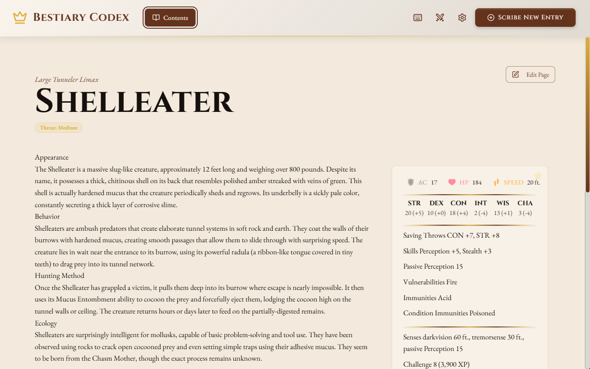
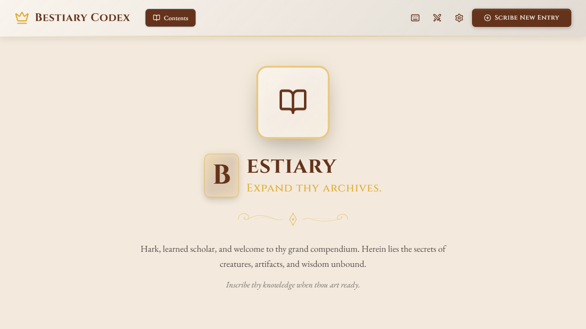
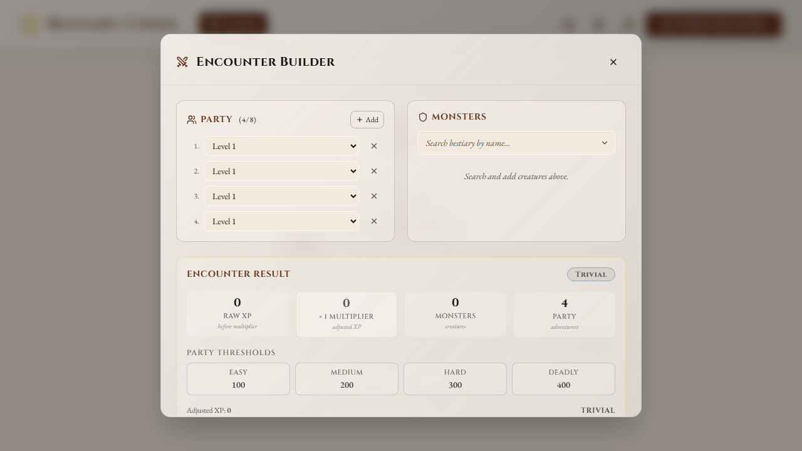

# Bestiary

[](https://github.com/nrew/bestiary/actions/workflows/ci.yml)
[](https://github.com/nrew/bestiary/releases)
[](LICENSE)
[](https://tauri.app/)
[](src-tauri/Cargo.toml)
[](tsconfig.json)

An offline desktop bestiary, item, and ability compendium for tabletop role-playing games. It is built with [Tauri 2](https://tauri.app/), React 19, and SQLite.

Bestiary keeps monsters, magic items, abilities, and conditions on your machine. There is no cloud, no account, and no telemetry. You can export everything to a single JSON file whenever you want.

## Contents

- [Screenshots](#screenshots)
- [Installation](#installation)
- [Updating](#updating)
- [Backup, import, and export](#backup-import-and-export)
- [Troubleshooting](#troubleshooting)
- [Build from source](#build-from-source)
- [Known limitations](#known-limitations)
- [Content & licensing](#content--licensing)
- [Documentation & community](#documentation--community)
- [License](#license)
- [Support](#support)

## Screenshots



| Library | Encounter Builder |
| ------- | ----------------- |
|  |  |


## Installation

Head to [GitHub Releases](https://github.com/nrew/bestiary/releases) and grab the build for your OS:

- **Windows 10/11**: the `.exe` installer, or the `_portable.zip` if you just want a standalone executable with no installation
- **macOS 11+**: the universal `.dmg`
- **Linux**: the `.AppImage` or `.deb`

Run it and you're done. Your data is stored in the OS app-data directory, not inside the install folder: `%APPDATA%\bestiary\` on Windows, `~/Library/Application Support/bestiary/` on macOS, or `~/.local/share/bestiary/` on Linux.

## Updating

Bestiary does not auto-update yet. To update manually:

1. Close Bestiary.
2. Export a backup from **Settings → Export database** and keep it outside the app data folder.
3. Download the newest installer from [GitHub Releases](https://github.com/nrew/bestiary/releases).
4. Run the installer over your existing install.
5. Open the app and confirm your entries and images look right.

The database stays in the OS app data directory, so reinstalling usually keeps your data. If an uninstaller offers to delete app data, say no unless you already have a backup.

## Backup, import, and export

Data is stored in SQLite plus an `images/` directory. To move a campaign to another machine:

1. In **Settings**, choose **Export database**. The app writes a timestamped JSON file (entries + image bytes) under `backups/` in your app data directory.
2. Copy that JSON to the other machine.
3. On the destination, use **Import database** and select the file.

Import is upsert-style: same ID replaces the existing row.

## Troubleshooting

**The window never appears after install.** The window is shown after the database initializes. If init fails, check the log in your app data directory. If the window is still missing, open an issue and attach that log if you can.

**“Bundled starting data could not be loaded.”** Your saved DB was not modified. Update or reinstall; keep a backup export handy.

**Import fails with “Invalid image path provided.”** Very old exports can be malformed. Re-export from the source machine if possible.

**Gallery shows “Invalid image path.”** The DB points at files that are gone (often after deleting `images/`). Run **Cleanup orphaned images** in Settings, then re-attach images.

**Large SQLite WAL file.** WAL is checkpointed on clean exit. If you killed the process, reopen the app so recovery can run; the WAL truncates on the next clean exit.

**macOS — "Bestiary cannot be opened because the developer cannot be verified."** Installers are not notarized. Right-click the `.app`, choose **Open**, and confirm in the dialog. Or from Terminal: `xattr -dr com.apple.quarantine /Applications/Bestiary.app`.

**Windows — "Windows protected your PC."** Installers are not code-signed. Click **More info → Run anyway**. Corporate environments that block unsigned executables will need a source build.

**Linux — AppImage won't launch.** Make it executable first: `chmod +x Bestiary_<version>_amd64.AppImage`. The `.deb` installer will warn about a missing signature but proceeds normally.

## Build from source

You need:

- [Node.js](https://nodejs.org/) (version in `.nvmrc`)
- [Rust](https://rustup.rs/) (channel in `rust-toolchain.toml`)
- [Tauri 2 prerequisites](https://tauri.app/start/prerequisites/) for your OS

```bash
npm ci
npm run tauri:dev
npm run tauri:build
```

Full local verification:

```bash
npm run verify
```

That runs type generation, TypeScript, ESLint, the Vite production build, Vitest, Rust `fmt`, `clippy` with `-D warnings`, and `cargo test --locked`.

For release candidates:

```bash
npm run verify:release
```

That adds `npm audit`, the documented Rust advisory check, and a Tauri installer build.

### Security audits

CI runs Rust advisory checks. Before a public release, run npm and Cargo audits locally:

```bash
npm run audit:npm
cargo install cargo-audit
npm run audit:rust
```

`npm run audit:rust` ignores `RUSTSEC-2023-0071` because the app is SQLite-only and does not use MySQL; SQLx still pulls the affected crate. Revisit if that changes.

Report suspected vulnerabilities privately; see [SECURITY.md](SECURITY.md).

## Content & licensing

**Bundled seed data** is a sample entry: one monster, three items, three abilities, and two statuses. It uses SRD-style terminology as example content.

**Game terminology.** Bestiary uses D&D 5e-style terms that appear in the [SRD 5.1](https://dnd.wizards.com/resources/systems-reference-document) (Wizards of the Coast, [CC BY 4.0](https://creativecommons.org/licenses/by/4.0/)). This app is not a substitute for the SRD or official books.

**Your content stays yours.** Nothing is uploaded. If you import third-party material, you are responsible for licence and attribution.

**Trademarks.** *Dungeons & Dragons*, *D&D*, and related names are trademarks of Wizards of the Coast LLC. This project is independent and not affiliated with Wizards.

**Icons.** See `src/assets/icons/dnd/ability/readme.md`. If an asset should not be here, open an issue.

**Fonts.** EB Garamond and Cinzel are bundled under the SIL Open Font License.

## Documentation & community

| Topic | Where to read |
| ----- | ------------- |
| Contributing, verification, PR habits | [CONTRIBUTING.md](CONTRIBUTING.md) |
| Reporting security issues | [SECURITY.md](SECURITY.md) |
| Version history (keep a changelog) | [CHANGELOG.md](CHANGELOG.md) |

## License

Released under the [MIT License](LICENSE). Copyright © 2026 Nrew. The licence covers this repository; it does not cover your private campaign data or third-party imports.

## Support

Bug reports and feature discussion belong on [GitHub Issues](https://github.com/nrew/bestiary/issues). Pull requests are welcome; see [CONTRIBUTING.md](CONTRIBUTING.md).
